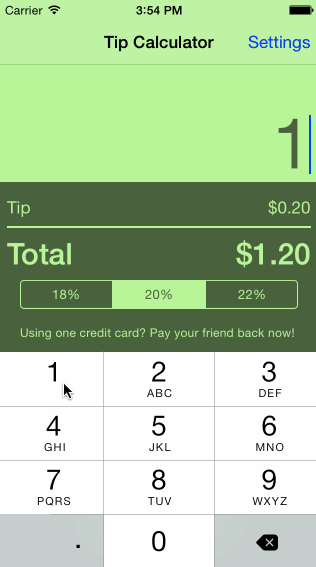
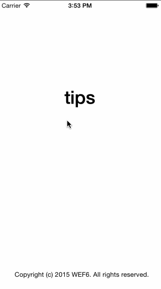

#TipCalculator

This is a Tip Calculator application for iOS submitted as the [pre-assignment](https://gist.github.com/timothy1ee/7747214) requirement for CodePath.

Time spent: 11:45 hours so far
Breakdown:
- 45 minutes to go through walkthrough and type it up
- 3 hours to do task 2, 3, and 4 in below completed checklist
- 4 hours to complete the last task (okay, I skipped one; it looked boring) + install Cocoapods and then get the Venmo SDK half-way functional. Currently my app is asking users for their venmo info (or directing them to the venmo app if it exists), but I haven't created the Venmo view yet or the pay API call method
- 2 hours to build front end for Venmo View and get general connectivity up for sending payments
- 2 hours to fix bug where the arguments to send money via Venmo API needed UInt type rather than Int

Completed:

* [x] Required: User can enter a bill amount, choose a tip percentage, and see the tip and total values.
* [x] Required: Settings page to change the default tip percentage.
* [x] Optional: UI animations
* [x] Optional: Remembering the bill amount across app restarts (if less than 10 minutes)
* [] Optional: Using locale-specific currency and currency thousands separators.
* [x] Optional: Making sure the keyboard is always visible and the bill amount is always the first responder. This way the user doesn't have to tap anywhere to use this app. Just launch the app and start typing. (chose to still keep the touch on the scene closing the keyboard so I could add additional functionality in the space covered by keyboard)
* [x] Integrate with Venmo

- Basic Functionality (including storing data between launches)

- Venmo Functionality

Note: to embed the gif file, just check your gif file into your repo and update the name of the file above.
